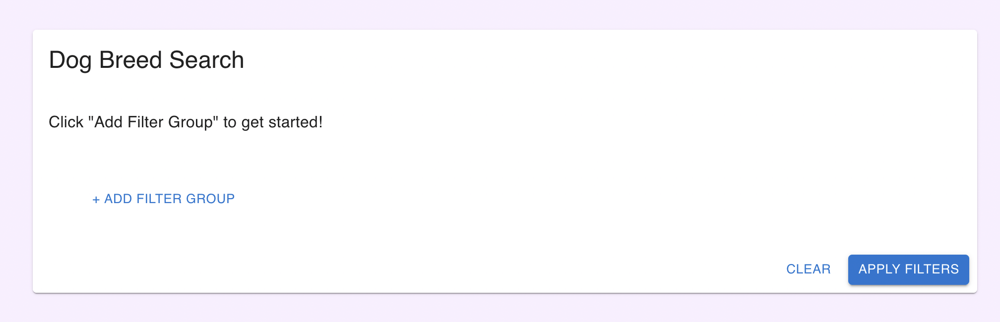
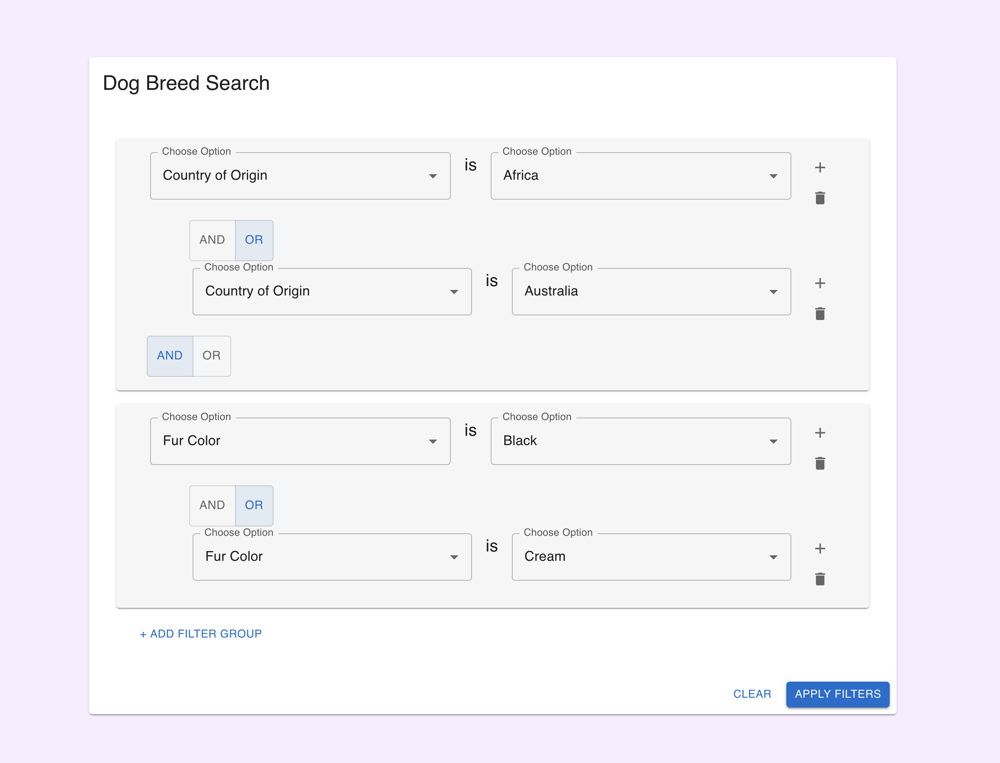
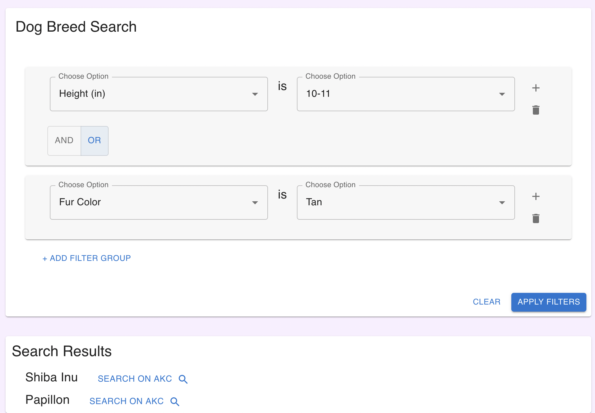

## Notes
This is work in progress solution for the Moonhub [frontend take home challenge](https://halved-mosquito-ec6.notion.site/Take-home-Challenge-Front-end-Boolean-Search-09b183f2c57e4149b6682e1acda689f0).

Architecture diagrams and wireframes can be found in `src/diagrams`.

The current state of this project is incomplete—the frontend components are displayed and values can be selected, but the filtering logic has not been finished. Filters can be cleared with the `clear` button on the bottom left, and filters can also be deleted using the trashcan icon to the right of a filter group. The logic to implement the search is in a pseudocode state and is commented out in `FilterContainer`.

### Download and usage instructions
Git clone the repo locally and run `npm start` to start a local server to view the website on `localhost:3000`

## Future Work
To improve on this for the future, I would port the data into a database and create API's to get all attributes, options for each attribute, and to implement the searching function. Currently all the logic is handled in the frontend, which does not scale if we want to handle a lot more data and have more complex searches.

The current implementation also uses vanilla React with a lot of prop drilling. If the app becomes more complex I'd like to avoid doing this and instead add Redux for better state management. I would also add other filtering options such as "is not".

## Screenshots

